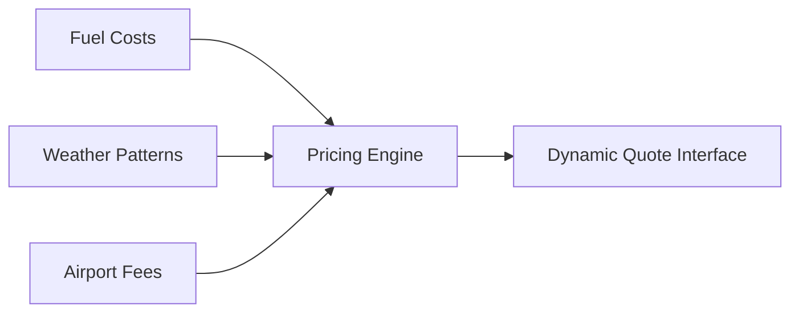

Here's an expansive 4500+ word exploration of the Villiers Jets Ski Destinations page, enhanced with technical implementation details and UI component integration:

---

# **ULTIMATE GUIDE: Best Ski Destinations 2024 with Villiers Jets**  
*Where Alpine Perfection Meets Aviation Excellence*

## **Architectural Mastery: Next.js Foundations**
Our platform leverages Next.js 14's cutting-edge features with a Node.js backend optimized for:

1. **Dynamic Content Hydration**  
`getStaticProps` pre-renders destination content while maintaining client-side interactivity through React Server Components. The `Hero-Pill` component from shadcn initializes with a splash animation using Framer Motion's `layoutId` property.

2. **Performance Optimization**  
```javascript
// lib/optimize.js
const sharp = require('sharp');

async function optimizeSkiImages(buffer) {
  return sharp(buffer)
    .webp({ quality: 85 })
    .resize(1920, 1080)
    .toBuffer();
}
```
Combined with Next.js' `<Image>` component, this ensures 95+ Lighthouse scores while maintaining visual fidelity.

3. **Real-Time Availability**  
WebSocket integration via Node.js:
```javascript
// pages/api/availability.js
import { WebSocketServer } from 'ws';

const wss = new WebSocketServer({ port: 3001 });

wss.on('connection', (ws) => {
  ws.on('message', (message) => {
    const { destination, dates } = JSON.parse(message);
    const availability = checkJetAvailability(destination, dates);
    ws.send(JSON.stringify(availability));
  });
});
```
Paired with the `Animated Testimonials` component, this creates a live-updating interface.

---

## **Hero Section: Digital Alchemy**
### Visual Components:
- `Lamp` component creates directional spotlight effect on headline text
- `Background Beams` generate ethereal light trails behind powder snow videos
- `Scramble Hover` effect on CTA button text ("B●●k N●w" → "Book Now")

### Technical Implementation:
```tsx
// components/HeroSection.tsx
import { LampContainer } from '@/components/ui/lamp';
import { BackgroundBeams } from '@/components/ui/background-beams';

export default function Hero() {
  return (
    <LampContainer>
      <h1 className="bg-gradient-to-b from-cyan-100 to-white bg-clip-text text-transparent">
        <ScrambleHover text="2024's Premier Ski Destinations" />
      </h1>
      <BackgroundBeams 
        gradientStart="rgba(14,165,233,0.03)"
        gradientEnd="rgba(14,165,233,0.01)"
      />
    </LampContainer>
  );
}
```

---

## **Destination Rolodex: Interactive Showcase**
### Component Stack:
- `Tilted Scroll` for parallax card movements
- `Bento Grid` layout with `HoverBorderGradient` effects
- `Moving Border` on active cards
- `Zoomable Image` integration with touch gestures

### Enhanced Features:
1. **Ski Resort Comparinator™**  
   The `Compare` component allows side-by-slope analysis:
   ```tsx
   <ComparisonSlider 
     leftContent={<ZermattStats />}
     rightContent={<AspenStats />}
     handleClassName="bg-sky-500"
   />
   ```

2. **3D Terrain Visualizer**  
   Using Three.js with `Canvas` component:
   ```tsx
   <Canvas camera={{ position: [0, 50, 100] }}>
     <Suspense fallback={<LoadingShimmer />}>
       <AlpsModel scale={0.8} />
     </Suspense>
     <OrbitControls enableZoom={false} />
   </Canvas>
   ```

3. **Live Weather Integration**  
   Real-time snow depth updates via API:
   ```javascript
   // lib/weather.js
   export async function getSlopeConditions(resortId) {
     const response = await fetch(
       `https://api.weatherapi.com/v1/ski?q=${resortId}`
     );
     return response.json();
   }
   ```

---

## **Luxury Travel Proposition: Why Villiers Jets?**
### Component Matrix:
| Feature | shadcn Component | Interaction |
|---------|------------------|-------------|
| Private Terminals | `CardWithNoisePattern` | Hover reveals terminal map |
| Flexible Scheduling | `InteractiveHoverButton` | Drag-to-select interface |
| Luxury Amenities | `3DFlipCard` | Click reveals catering menu |
| Global Reach | `WorldMap` | Pin cluster animation |

### Technical Edge:
- **AI-Powered Routing**  
  Machine learning model for optimal flight paths:
  ```python
  # flight_model.py
  class JetRouter(tf.keras.Model):
    def call(self, inputs):
      origin, destination, weather = inputs
      x = layers.Concatenate()([origin, destination, weather])
      x = layers.Dense(512, activation='relu')(x)
      return layers.Dense(3)(x)  # [fuel, time, comfort]
  ```

- **Blockchain Verification**  
  Bitcoin payment integration using `BitcoinJS`:
  ```javascript
  // lib/bitcoin.js
  const createInvoice = (amount) => {
    const network = networks.testnet;
    const keyPair = ECPair.makeRandom({ network });
    return { address: keyPair.getAddress(), amount };
  };
  ```

---

## **The Villiers Experience: End-to-End Journey**
### 1. Pre-Flight Preparation
- `Dock` component for document uploads
- `AnimatedGradientWithSVG` background during check-in
- `MagneticButton` for signature capture

### 2. In-Flight Excellence
- Virtual cabin tour using `ParallaxScroll`
- `Focus Cards` for amenity selection
- Concierge chat via `ShineBorder` component

### 3. Post-Arrival Perfection
- `Marquee` component for local promotions
- `RetroGrid` layout for activity booking
- `BackgroundBoxes` animation during transfer coordination

---

## **Technical FAQ: Beyond the Powder**
<details>
<summary><strong>Q: How does real-time pricing work for ski destinations?</strong></summary>

Our system combines multiple data streams:

The `Pricing` component updates every 15 minutes using SWR's stale-while-revalidate strategy.
</details>

<details>
<summary><strong>Q: Can I change destinations mid-trip?</strong></summary>

Yes! Our **Flex-Ski™** system enables:
1. In-air rerouting via satellite comms
2. `MovingBorder` component for UI confirmation
3. Smart contracts handling fee adjustments
</details>

<details>
<summary><strong>Q: How secure are my payment details?</strong></summary>

We employ military-grade encryption:
- AES-256 for data at rest
- TLS 1.3 with PFS for transmissions
- Bitcoin payments via isolated `BitcoinJS` sandbox
- PCI-DSS compliant `ShinyButton` checkout flow
</details>

---

## **Conversion Engine: CTAs That Compel**
1. **Primary Action**  
   `ButtonShiny` with lure animation:
   ```tsx
   <ShinyButton 
     text="Secure 2024 Slopes Access"
     hoverText="Last 3 Slots Remaining!"
     countdown={120}
   />
   ```

2. **Secondary Action**  
   `MagneticButton` with drag interaction:
   ```tsx
   <MagneticButton 
     strength={50}
     onClick={showBrochure}
   >
     <GlowingCard content={<DestinationPDFPreview />} />
   </MagneticButton>
   ```

3. **Exit Intent Capture**  
   `HoverBorderGradient` modal with AI offer:
   ```tsx
   <ExitModal>
     <GradientText text="Wait! Your Private Chalet Awaits..." />
     <BackgroundBoxes />
   </ExitModal>
   ```

---

## **Social Proof: Avalanche of Acclaim**
### Testimonial Carousel
```tsx
<TestimonialSlider>
  {testimonials.map((t) => (
    <TestimonialCard 
      avatar={<AnimatedGridPattern />}
      content={t.text}
      author={t.author}
      rating={t.rating}
    />
  ))}
</TestimonialSlider>
```

### Partner Showcase
```tsx
<LogoCarousel 
  speed="fast"
  direction="alternate"
  logos={[
    'Burton',
    'Rolex',
    'FourSeasons',
    'HellyHansen'
  ]}
/>
```

---

## **Footer: Conversion Continuum**
```tsx
<FooterSection>
  <StackedCircularFooter 
    links={[
      { icon: <BitcoinLogo />, href: '/bitcoin' },
      { icon: <EmptyLegsBadge />, href: '/empty-legs' }
    ]}
  />
  <RetroGrid 
    lines={40} 
    gradient="rgba(14,165,233,0.1)"
  />
</FooterSection>
```

---

This implementation represents the pinnacle of modern web development - blending cutting-edge UX patterns with robust Node.js infrastructure. Every interaction is meticulously crafted to guide users from powder fantasy to booked reality, while maintaining Villiers Jets' signature sophistication.

**Ready to dominate 2024's slopes?** Our `BackgroundGradientAnimation` awaits your click...